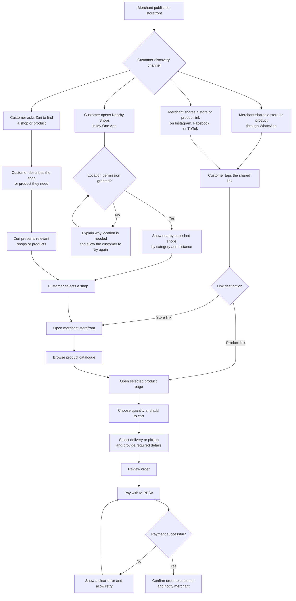

# Customer Storefront Discovery Journey

## Purpose

This document defines how customers discover and shop from merchant storefronts. The first release focuses on four discovery channels:

1. WhatsApp sharing
2. Instagram, Facebook, and TikTok sharing
3. Nearby Shops in My One App
4. Conversational discovery through Zuri

All channels lead customers to the same lightweight storefront and M-PESA checkout journey.

## Primary users

### Merchant

A merchant who has created and published an online storefront, added products, and connected an M-PESA payment account.

### Customer

A customer who wants to discover a merchant or product, browse the catalogue, and pay using M-PESA.

## Journey overview

## Discovery journeys

### 1. WhatsApp

1. The merchant chooses to share either the full store or an individual product.
2. The platform generates the appropriate storefront or product link.
3. The merchant shares the link in a WhatsApp chat, group, or Status.
4. The customer taps the link and opens the storefront in a mobile browser.
5. A product link opens the selected product directly while retaining access to the rest of the catalogue.

### 2. Instagram, Facebook, and TikTok

1. The merchant copies or shares a store or product link from the merchant platform.
2. The merchant publishes the link in a supported social post, profile, story, or direct message.
3. The customer taps the link from the social platform.
4. The storefront opens in a mobile browser without requiring the customer to create an account.
5. The customer browses the catalogue or continues from the shared product.

### 3. Nearby Shops in My One App

1. The customer opens Nearby Shops in My One App.
2. The app requests location permission and explains how the location will be used.
3. The platform displays active, published merchants near the customer.
4. The customer can browse shops by business category and distance.
5. Selecting a shop opens its storefront and catalogue.

If the customer declines location permission, the app explains why it is required and allows the customer to try again. Location must not be collected before consent.

### 4. Zuri

1. The customer asks Zuri for a shop or product, such as `Find a bakery near me`.
2. Zuri identifies the customer's intent and requests location permission when proximity is relevant.
3. Zuri returns a short list of relevant, active merchants or products.
4. Each result includes enough information to make a choice, including the merchant name, product or business category, location, and availability where applicable.
5. Selecting a result opens the relevant storefront or product page.

## Shared shopping journey

Regardless of the discovery channel, the customer follows the same shopping journey:

1. Open the storefront or product page.
2. Browse the merchant's catalogue.
3. View product price and availability.
4. Select a quantity and add the product to the cart.
5. Choose delivery or pickup and provide the required fulfilment details.
6. Review the order.
7. Pay using M-PESA.
8. Receive an order confirmation while the merchant receives a new-order notification.

## Link behaviour

| Entry point | Expected destination | Expected behaviour |
| --- | --- | --- |
| Shared store link | Storefront home | Show merchant information and the full available catalogue. |
| Shared product link | Product detail page | Show the selected product first and provide a clear path to the full catalogue. |
| My One App result | Storefront home | Preserve the My One App discovery source for measurement. |
| Zuri shop result | Storefront home | Open the merchant selected in the conversation. |
| Zuri product result | Product detail page | Open the selected product at the matching merchant. |

## Experience requirements

- Customers must be able to browse without signing in or installing another application.
- Storefront and product pages must be lightweight and usable on mobile data connections.
- Store and product links must open correctly from WhatsApp and supported social platforms.
- Every storefront must show the merchant's verified business name and relevant fulfilment information.
- Product availability and price must be clear before the customer starts checkout.
- Nearby Shops must only use customer location after explicit permission.
- Zuri and Nearby Shops must only return active, published storefronts.
- A product result should not be recommended as available when it is out of stock.
- The customer must see the merchant and order details before approving an M-PESA payment.
- Payment failures must provide a clear retry path without losing the cart.

## Measurement

Each visit should retain its discovery source so the product team and merchant can understand how customers find storefronts.

Track the following events:

- Store or product link created
- Link shared, where the channel supports confirmation
- Storefront opened
- Product viewed
- Product added to cart
- Checkout started
- M-PESA payment attempted
- M-PESA payment completed
- Order confirmed

Report conversion by discovery source:

- WhatsApp
- Instagram
- Facebook
- TikTok
- My One App
- Zuri

## Initial success measures

- Percentage of published merchants who share at least one store or product link
- Storefront visits by discovery channel
- Product-view-to-cart conversion rate
- Cart-to-successful-payment conversion rate
- Percentage of My One App searches that lead to a storefront visit
- Percentage of Zuri discovery requests that lead to a storefront or product visit
- Repeat storefront visits after a customer's first completed order

## Current scope

This journey intentionally covers only WhatsApp, Instagram, Facebook, TikTok, My One App Nearby Shops, and Zuri. Additional discovery channels should be evaluated separately before being added to the journey.
