# Merchant Onboarding and Business Management Journey

## Purpose

This document defines how a merchant discovers, joins, and operates the online-store service. It supports three onboarding channels:

1. SMS for merchants using feature phones
2. WhatsApp through Zuri
3. M-PESA Business Hub

The three routes create the same merchant profile and storefront. A merchant can switch channels without losing progress and can later use any supported channel to manage the business.

For the related customer experience, see [Customer Storefront Discovery Journey](./customer-journey.md).

## Primary user

The primary user is an existing or prospective Safaricom merchant who wants to:

- Create an online storefront
- Connect a Till, PayBill, or Pochi La Biashara account
- Add products and manage stock
- Receive and fulfil customer orders
- Reconcile M-PESA payments
- Review sales and settlement information

## Journey overview

```mermaid
flowchart TB
    Need["Merchant needs to sell online"]
    Entry{"How does the merchant<br/>discover or access the service?"}
    Continue["Merchant can switch between SMS, WhatsApp Zuri,<br/>and Business Hub without losing progress"]

    Need --> Entry
    Continue -. Applies throughout onboarding and management .-> Entry

    subgraph SMS["Journey 1 — SMS / feature phone"]
        direction TB
        S1["Receive campaign SMS<br/>or merchant invitation"]
        S2["Reply with registration keyword"]
        S3["Select language and accept terms"]
        S4["Enter merchant name<br/>and business details"]
        S5{"Existing M-PESA Till,<br/>PayBill, or Pochi La Biashara?"}
        S6["Receive guided payment-account<br/>setup instructions"]
        S7["Enter and verify existing<br/>payment account"]
        S8["Create first product using<br/>structured SMS prompts"]
        S9["Receive store link and<br/>secure merchant PIN"]

        S1 --> S2 --> S3 --> S4 --> S5
        S5 -->|No| S6 --> S8
        S5 -->|Yes| S7 --> S8
        S8 --> S9
    end

    subgraph ZURI["Journey 2 — WhatsApp Zuri"]
        direction TB
        Z1["Discover service through<br/>Zuri or a campaign"]
        Z2["Start guided conversation"]
        Z3["Select language and accept terms"]
        Z4["Verify mobile number<br/>and business identity"]
        Z5{"Existing M-PESA Till,<br/>PayBill, or Pochi La Biashara?"}
        Z6["Begin assisted payment-account setup"]
        Z7["Connect and verify existing<br/>payment account"]
        Z8["Add business name,<br/>logo, and category"]
        Z9["Add products, images,<br/>prices, and stock"]
        Z10["Review store summary<br/>and open preview link"]

        Z1 --> Z2 --> Z3 --> Z4 --> Z5
        Z5 -->|No| Z6 --> Z8
        Z5 -->|Yes| Z7 --> Z8
        Z8 --> Z9 --> Z10
    end

    subgraph HUB["Journey 3 — M-PESA Business Hub"]
        direction TB
        H1["Discover Merchant Store<br/>in Business Hub"]
        H2["Review benefits, pricing,<br/>and storefront examples"]
        H3["Select Create online store"]
        H4["Sign in with existing<br/>merchant identity"]
        H5["Review prefilled<br/>business information"]
        H6["Select Till, PayBill, or<br/>Pochi La Biashara for payments"]
        H7["Choose store template<br/>and business category"]
        H8["Add or import products"]
        H9["Configure delivery, collection,<br/>and contact details"]
        H10["Preview storefront"]

        H1 --> H2 --> H3 --> H4 --> H5 --> H6 --> H7 --> H8 --> H9 --> H10
    end

    Entry -->|SMS or campaign| S1
    Entry -->|WhatsApp or Zuri| Z1
    Entry -->|Business Hub| H1

    S9 --> Complete
    Z10 --> Complete
    H10 --> Complete

    subgraph ACTIVATE["Shared storefront activation"]
        direction TB
        Complete{"Store information complete?"}
        Correct["Show missing information<br/>and guide correction"]
        Review["Review terms, fees, and selected<br/>M-PESA payment destination"]
        Publish["Publish digital storefront"]
        Promote["Share store or product through WhatsApp,<br/>Instagram, Facebook, or TikTok"]
        Discoverable["Store becomes discoverable through<br/>My One App Nearby Shops and Zuri"]

        Complete -->|No| Correct --> Complete
        Complete -->|Yes| Review --> Publish
        Publish --> Promote
        Publish --> Discoverable
    end

    Promote --> Customer["Customer opens storefront or product"]
    Discoverable --> Customer
    Customer --> Browse["Customer browses products<br/>and creates an order"]
    Browse --> Details["Customer provides contact<br/>and fulfilment details"]
    Details --> Authorize["Customer authorizes M-PESA payment"]

    subgraph OPERATE["Shared merchant lifecycle"]
        direction TB
        Paid{"Payment successful?"}
        Retry["Customer retries payment or<br/>selects another M-PESA number"]
        Notice["Merchant receives order<br/>and payment notification"]
        Fulfil{"Can the merchant fulfil the order?"}
        Resolve["Contact customer, substitute item,<br/>cancel order, or issue refund"]
        Prepare["Prepare order for<br/>delivery or collection"]
        Confirm["Confirm fulfilment<br/>and notify customer"]
        Reconcile["Update stock and reconcile<br/>the M-PESA transaction"]
        Monitor["View sales, orders, stock alerts,<br/>and settlement summary"]
        Grow["Add products, customers, staff,<br/>or premium capabilities"]

        Paid -->|No| Retry --> Authorize
        Paid -->|Yes| Notice --> Fulfil
        Fulfil -->|No| Resolve --> Reconcile
        Fulfil -->|Yes| Prepare --> Confirm --> Reconcile
        Reconcile --> Monitor --> Grow
    end

    Authorize --> Paid
    Grow --> Promote

    Correct -. Help needed .-> Support
    Resolve -. Help needed .-> Support
    Retry -. Repeated failure .-> Support
    Support["Access Zuri, SMS help,<br/>or Business Hub support"]
```

## Omnichannel continuity

The platform must maintain one merchant identity and one onboarding record across all three channels.

Examples:

- A merchant can begin registration over SMS and later add product images through WhatsApp Zuri.
- A merchant can start with Zuri and later use Business Hub for full catalogue management.
- A merchant can receive an SMS order alert and open Business Hub to fulfil the order.
- The platform resumes at the last completed step instead of restarting onboarding.

The merchant's phone number and verified business identity should be used to locate the existing onboarding session. Sensitive actions must still require appropriate authentication.

## Onboarding journeys

### 1. SMS and feature phone

1. The merchant receives a campaign SMS or invitation.
2. The merchant replies with the registration keyword.
3. The merchant selects a language and accepts the applicable terms.
4. Structured prompts collect the merchant and business details.
5. The merchant connects an existing Till, PayBill, or Pochi La Biashara account, or receives guided setup instructions.
6. The merchant creates the first product using structured prompts for name, price, and stock.
7. The platform provides the store link and a secure way to establish the merchant PIN.
8. The merchant can continue through another channel without losing the information already entered.

SMS prompts must be short, numbered, and recoverable. Invalid replies should explain the expected format without deleting previously entered information.

### 2. WhatsApp Zuri

1. The merchant discovers the service through Zuri or a campaign and starts a guided conversation.
2. The merchant selects a language and accepts the terms.
3. Zuri verifies the mobile number and business identity.
4. The merchant connects an existing M-PESA business account or starts assisted payment setup.
5. The merchant adds the business name, logo, and category.
6. The merchant adds product images, prices, and available stock.
7. Zuri presents a store summary and a link to preview the storefront.
8. Missing information is highlighted before publication.

Zuri should use short prompts, clear choices, and resumable steps. A merchant must be able to request human or Business Hub support when needed.

### 3. M-PESA Business Hub

1. The merchant discovers Merchant Store in Business Hub.
2. The merchant reviews the benefits, pricing, and storefront examples.
3. The merchant selects **Create online store** and signs in with an existing merchant identity.
4. The platform pre-fills known business information for review rather than asking the merchant to enter it again.
5. The merchant selects the Till, PayBill, or Pochi La Biashara account that will receive payments.
6. The merchant chooses a template and business category.
7. The merchant adds or imports products.
8. The merchant configures delivery, collection, and customer contact details.
9. The merchant previews the storefront before publishing.

## Store activation

Before a storefront can be published, the platform must verify that the required information is complete. At minimum, this includes:

- Verified merchant and business identity
- Selected and verified M-PESA payment destination
- Business name and category
- At least one valid product with a price
- Customer contact method
- Supported delivery or collection option
- Acceptance of current terms and fees

If information is missing, the merchant is returned to the relevant field with a clear explanation. Completed information must be preserved.

After validation, the merchant reviews the payment destination, applicable fees, and terms before publishing the storefront.

## Store promotion and discovery

Once the store is published:

- The merchant can share the entire store or an individual product through WhatsApp.
- The merchant can share store or product links on Instagram, Facebook, and TikTok.
- The published store can appear in My One App Nearby Shops when the merchant has provided an eligible location.
- The published store and products can be returned in relevant Zuri conversations.

All entry points must lead to the same current catalogue, pricing, stock, and M-PESA checkout journey.

## Order, payment, and fulfilment

1. A customer browses the storefront and creates an order.
2. The customer provides the required contact and fulfilment details.
3. The customer authorizes payment through M-PESA.
4. If payment fails, the customer can retry or select another M-PESA number without losing the order.
5. After successful payment, the merchant receives an order and payment notification.
6. The merchant confirms whether the order can be fulfilled.
7. If fulfilment is possible, the merchant prepares the order for delivery or collection and notifies the customer.
8. If fulfilment is not possible, the merchant contacts the customer to substitute the item, cancel the order, or issue a refund.
9. The platform updates stock and reconciles the M-PESA transaction.

## Business management

After activation, the merchant can use the supported channels to:

- View new and active orders
- Update order and fulfilment status
- Add or update products
- Adjust stock
- Review sales and settlement summaries
- Receive low-stock and operational alerts
- Manage customer and staff access where supported
- Access additional or premium capabilities
- Request support through Zuri, SMS help, or Business Hub

Channel capabilities may differ, but all channels must read from and update the same merchant, catalogue, inventory, order, and payment records.

## Exception and recovery requirements

- Every onboarding step must be resumable.
- Invalid or incomplete information must produce a specific corrective instruction.
- Failed payment-account verification must not erase the merchant's store setup.
- Repeated payment failures must provide a support path.
- Orders must not be marked as paid until the M-PESA transaction is confirmed.
- Cancellation and refund actions must update both the order state and payment reconciliation state.
- A merchant PIN or authentication credential must never appear in a customer-facing store link.
- Support agents must be able to see the merchant's current journey step without requesting all information again.

## Measurement

Track onboarding and operations using a common merchant identifier across channels.

### Onboarding events

- Onboarding started
- Discovery channel selected
- Language selected
- Terms accepted
- Merchant identity verified
- Payment account connected
- Business profile completed
- First product created
- Store preview opened
- Store published
- Onboarding resumed in another channel

### Operational events

- Store or product shared
- Order received
- M-PESA payment confirmed or failed
- Order accepted or rejected
- Order prepared
- Order fulfilled
- Order cancelled
- Refund initiated and completed
- Stock updated
- Settlement summary viewed
- Support requested

## Initial success measures

- Onboarding completion rate by entry channel
- Median time from onboarding start to store publication
- Percentage of merchants who successfully connect an M-PESA payment destination
- Percentage of merchants who create at least one product
- Percentage of merchants who switch channels and successfully resume
- Percentage of published merchants who share a store or product
- Percentage of paid orders accepted and fulfilled
- M-PESA payment success rate
- Order cancellation and refund rate
- Monthly active merchants managing orders, products, or stock
- Support-request rate by journey step

## Current scope

This journey covers merchant onboarding through SMS, WhatsApp Zuri, and M-PESA Business Hub, followed by storefront activation, promotion, order handling, M-PESA payment, fulfilment, and ongoing business management.
